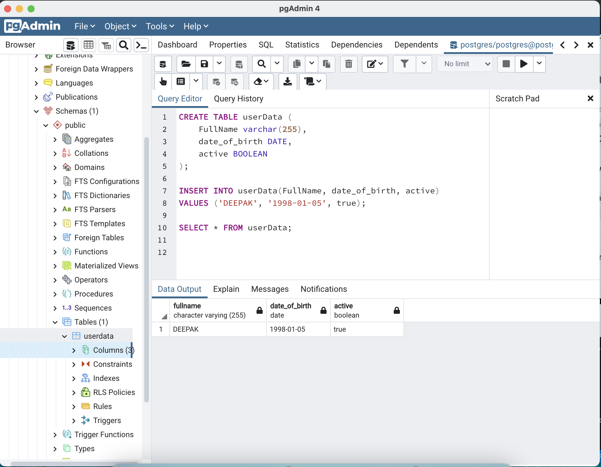

# Exercise 1.1
A database with docker

### Get publicly available docker image for db
- Run the following command to get **postres** image from docker hub 
  `docker run --name postgresDB-docker-exercise -p 5432:5432 -e POSTGRES_PASSWORD=mysecretpassword -d postgres` 

  The above command will pull image **postgres** from docker hub and run with port **5432**. Value of **POSTGRES_PASSWORD** will be default password for your postgres database.

### Database and Table
- Download and Install [PostgreSQL](https://www.postgresql.org/) if it is not installed in your machine
- Open **pgAdmin** application
- Create a new database (password will be the above used password, and port will be 5432)
- Run SQL queries to perform some actions, for example:
  - `CREATE TABLE userData(FullName varchar(255), date_of_birth DATE, active BOOLEAN);` 
    This will create **userData** table with 3 columns `FullName`, `date_of_birth` and `active`
  - `INSERT INTO userData(FullName, date_of_birth,active) VALUES ('DEEPAK', '1998-01-05', true);` 
    This will enter this specific data into the **userData** table
  - `SELECT * FROM userData;` 
    This will print all data from **userData** table

